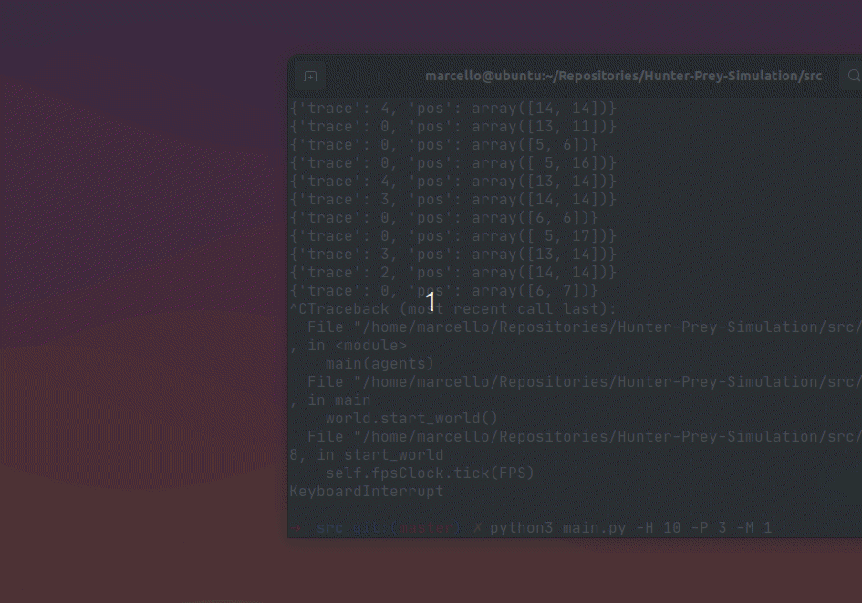

# Hunter-Prey Ecosystem

This project is an implementation of the Hunter-Prey Multi-Agent problem for the Computational Inteligence class.

The project uses Pygame and Numpy as libraries. To install both of them, run:

```pip install numpy pygame```

There are a few parameters that the model uses. 

- **H** is the number of hunters in the environment. Default is 4. 
- **P** is the number os preys. Default is 1. 
- **M** is the number os movements before a new direction is chosen, when wandering. Default is 10.

To run the model, run:

```python3 main.py```

To run a model with, for e.g, 13 hunters, 3 preys and a random direction, you must run:

```python3 main.py -H 10 -P 3 -M 1```

### Demo

